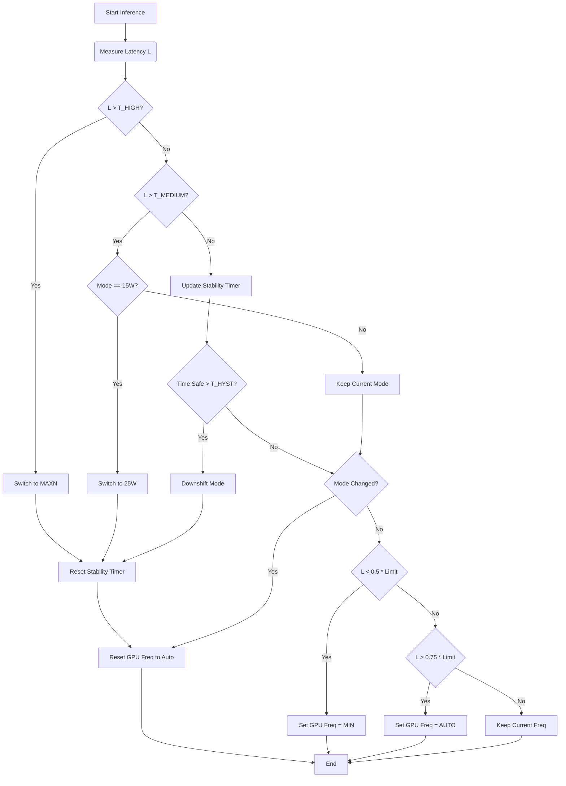

# Hierarchical Adaptive Power Management Algorithm

## 1. System Overview

The system employs a **Hierarchical Control Strategy** to balance energy efficiency and performance (SLA compliance). It operates on two time-scales:
1.  **Coarse-Grained (Power Modes):** Large adjustments (15W $\leftrightarrow$ 25W $\leftrightarrow$ MAXN) based on sustained latency trends.
2.  **Fine-Grained (DVFS):** Micro-adjustments (GPU Frequency) within a specific power mode to optimize for instantaneous load.

## 2. Algorithm Pseudocode

```python
# Constants
T_MEDIUM      = ... # Threshold for 15W -> 25W (e.g., 10ms)
T_HIGH        = ... # Threshold for 25W -> MAXN (e.g., 20ms)
T_HYSTERESIS  = 5.0 # Seconds to wait before downshifting
FREQ_COOLDOWN = 0.5 # Seconds between frequency changes

# State
current_mode  = "15W"
current_freq  = "AUTO"
timer_stable  = null # Tracks how long we've been efficient

def OnInferenceComplete(latency_ms):
    """
    Called immediately after every inference.
    Returns: New Power State configuration.
    """
    
    # --- LAYER 1: Coarse-Grained Power Mode Control ---
    
    mode_changed = False
    
    # 1. Critical Violation Check (Immediate Upshift)
    if latency_ms > T_HIGH:
        if current_mode != "MAXN":
            SetPowerMode("MAXN")
            mode_changed = True
            timer_stable = null # Reset stability timer
            
    elif latency_ms > T_MEDIUM:
        if current_mode == "15W":
            SetPowerMode("25W")
            mode_changed = True
            timer_stable = null
            
    # 2. Stability Check (Hysteresis Downshift)
    else:
        # Latency is safe. Start/Continue timer.
        if timer_stable is None:
            timer_stable = Now()
            
        time_safe = Now() - timer_stable
        
        if time_safe >= T_HYSTERESIS:
            # Gradual Downshift: MAXN -> 25W -> 15W
            if current_mode == "MAXN":
                SetPowerMode("25W")
                mode_changed = True
                timer_stable = Now() # Restart timer for next step
            elif current_mode == "25W":
                SetPowerMode("15W")
                mode_changed = True
                timer_stable = null
                
    # --- LAYER 2: Fine-Grained Frequency Control (DVFS) ---
    
    # If we just switched modes, reset frequency to ensure stability
    if mode_changed:
        GPU.ResetToAuto() 
        return

    # If Frequency Scaling is Enabled
    if ENABLE_FREQUENCY_SCALING and (Now() - last_freq_change > FREQ_COOLDOWN):
        
        # Determine safety margin based on current mode's ceiling
        limit = (T_MEDIUM if current_mode == "15W" else T_HIGH)
        
        # Logic A: Aggressive Power Saving
        # If we are using < 50% of our latency budget, drop GPU clocks
        if latency_ms < (limit * 0.50):
            target_freq = GPU.GetMinFreq()
            if GPU.CurrentFreq() != target_freq:
                GPU.SetFreq(target_freq) # Pin to minimum
                
        # Logic B: Pre-emptive Performance Boost
        # If we are approaching the limit (> 75%), release clamps
        elif latency_ms > (limit * 0.75):
            GPU.ResetToAuto() # Allow GPU to boost to Mode Max
```

## 3. Logic Flowchart



## 4. Maintenance Loop (Idle Handling)

To handle bursty workloads where the system goes silent (latency = 0 / infinite):

```python
def CheckMaintenance():
    """Called periodically (every 100ms) by the runner loop"""
    
    time_since_last_inference = Now() - last_inference_time
    
    if time_since_last_inference > T_HYSTERESIS:
        if current_mode != "15W":
            SetPowerMode("15W")
            GPU.ResetToAuto()
            Log("System Idle: Forced Downshift")
```
