# Adaptive Power Management Algorithm (Endurance Mode)

This diagram illustrates the logic used in the endurance study, specifically designed for "Guard Duty" cycles with long idle periods.

**Key Features:**
- **3-Tier Power States:** 15W (Low), 25W (Medium), MAXN (High).
- **Inference-Based Panic:** Latency violations trigger immediate upscaling (milliseconds).
- **Time-Based Patience:** Downscaling requires long periods of safety (e.g., 60 seconds) to prevent "thrashing" and energy waste during short pauses.

```mermaid
stateDiagram-v2
    direction TB
    
    %% States
    state "Low Power (15W)" as 15W
    state "Medium Power (25W)" as 25W
    state "High Power (MAXN)" as MAXN

    %% Initial State
    [*] --> 15W

    %% Upscaling Transitions (Immediate Priority - "Panic")
    %% Triggered by single inference latency violation
    15W --> MAXN : <b>Latency > High_Threshold</b><br/>(Immediate Switch)
    25W --> MAXN : <b>Latency > High_Threshold</b><br/>(Immediate Switch)
    15W --> 25W  : <b>Latency > Med_Threshold</b>

    %% Downscaling Transitions (Hysteresis Required - "Patience")
    %% Triggered only after EXTENDED duration of safety
    
    state "Hysteresis Check (60s)" as CheckHigh
    state "Hysteresis Check (60s)" as CheckMed

    MAXN --> CheckHigh : <b>Latency ≤ Med_Threshold</b>
    CheckHigh --> 25W : <b>Time > 60s</b>
    CheckHigh --> MAXN : <b>Latency Spike</b>

    25W --> CheckMed : <b>Latency ≤ Med_Threshold</b>
    CheckMed --> 15W : <b>Time > 60s</b>
    CheckMed --> 25W : <b>Latency Spike</b>

    %% Notes for clarity
    note right of MAXN
      <b>Sticky Behavior</b>
      System stays in MAXN 
      until 60 seconds of 
      continous low latency 
      is observed.
    end note
```

